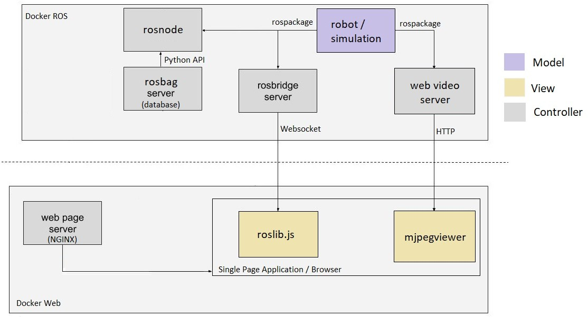

# ROS - WEB - Docker

My Final Project of Specialization Course at PUC Minas - Software Engineering

Image - https://www.theconstructsim.com/

A web page interface enable to move and monitor the turtlebot (running in the Gazebo Simulation), by publishing and subscribing ROS topics.

The deployment is done by docker containers.

rosbridge_server is used to provide the websocket interface to the JavaScript.

web_video_server is used to provide the interface to the camera images.

A ROS_node is also implemented to record the robot motion. The data is stored in a database (rosbag python API). 

It is also possible to read the data from the rosbag in order to move the robot with the same motion previously recorded.

The main program can be built and ran by doing the following from the project top directory:

## Build from source (this repo)

$ cd docker_ros 

$ docker build -t ros_nginx:v0 .

$ cd docker_web

$ docker build -t my_nginx:v0 . 

## Docker Hub

The docker images are also available in Docker Hub, and can be directly downloaded by:

$ docker pull viniciusabrao/my_nginx:v0

$ docker pull viniciusabrao/ros_nginx:v0

In this case the docker-compose file must be edited to rename the images including "viniciusabrao/".
## Running the application 

The app is configured (docker-compose.yml) to run in Ubuntu, since it opens the Gazebo in the host (to see the robot`s environment) from the docker container.

1- To run the docker-compose:

$ ./my_compose.sh

2- Open in browser:

http://0.0.0.0:9000/

3- ROSBridge address: 

ws://0.0.0.0:9090

4- To close (ctrl+c):

$ docker-compose down 

5- Stop containers:

$ docker kill $(docker ps -aq); 

6- Clear containers:

$ docker container prune -f 

7- To delete the images:

$ docker rmi --force viniciusabrao/my_nginx:v0

$ docker rmi --force viniciusabrao/ros_nginx:v0
