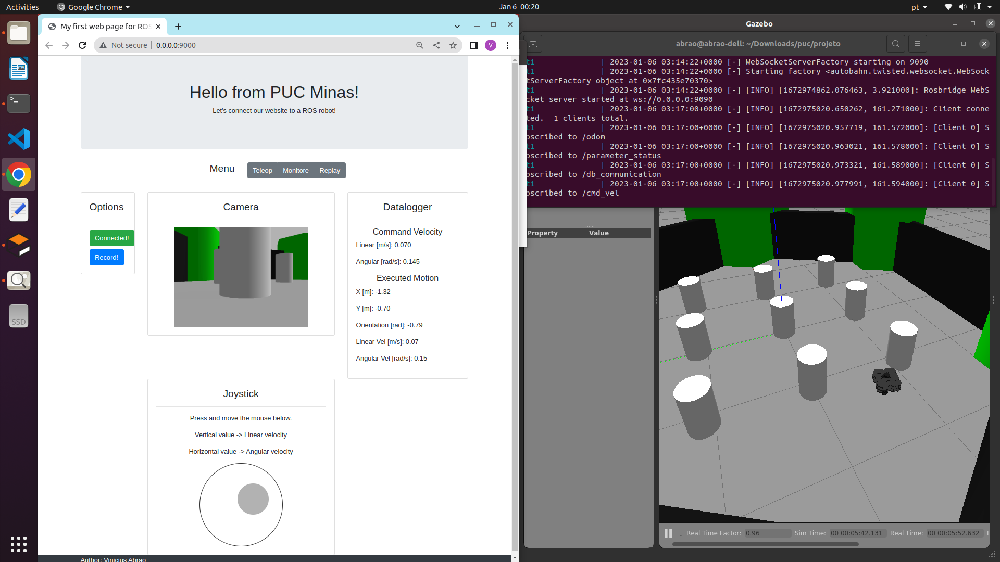

# ROS - WEB - Docker

My Final Project of Specialization Course at PUC Minas - Software Engineering

The web page interface enables to move and monitor the turtlebot (running in the Gazebo Simulation), by publishing and subscribing ROS topics.

The deployment is done by docker containers.

rosbridge_server is used to provide the websocket interface to the JavaScript.

web_video_server is used to provide the interface to the camera images.

A ROS_node is also implemented to record the robot motion. The data is stored in a database (rosbag python API). 

It is also possible to read the data from the rosbag in order to move the robot with the same motion previously recorded.

## Web Page Interface

In the interface image presented above is possible to see the main functionalities already implemented:

-The user log into the system with the ros bridge adress (ws://0.0.0.0:9090)

-The user have the option to disconnect and reconnect on the system

-The user must click and move mouse to perform joystick actions

-The user must select the linear speed of the robot by moving the mouse vertically

-The user must select the angular velocity of the robot by moving the mouse horizontally

-The user must select the commanded linear velocity values ​​in a range of -0.5 to 0.5 m/s

-The user must select the commanded angular velocity values ​​in a range of -0.5 to 0.5 rad/sec

-The user can view the linear speed values ​​commanded by the joystick

-The user can view the angular velocity values ​​commanded by the joystick

-The user can visualize the values ​​of linear velocity that the robot executed the movement

-The user can visualize the angular velocity values ​​that the robot executed the movement

-The user can view the X and Y coordinates of the robot's current position in relation to the map origin

-The user can visualize the orientation of the robot indicating how much it rotated in relation to the origin of the map

-The user can view the images from the camera embedded in the robot while it is moving

-The user can record the current position and orientation of the robot relative to the map origin

-The user can record the linear speed that the robot performed the movement

-The user can record the angular speed that the robot performed the movement

-The user can record the linear speed commanded by the joystick

-The user can record the angular velocity commanded by the joystick

-The user can record simulation time information

-The user can repeat the movement with previously recorded commanded speeds

Non-functional requirements:

-The system must make the connection through the rosbridge address

-The web interface must run on a desktop browser

-The gazebo simulation should be viewed without the need for a locally installed ROS

-Backend code should run without need to install ROS locally

-The web interface must communicate in real time (interval of up to 0.5 seconds) with the simulation

-The backend must be written in Python or C++ language that have native ROS library

-Database log file must be saved in ROS native format (rosbag)

-The application must have a setup to run promptly on the Ubuntu operating system

Tutorial Video (original audio in Portuguese but with step-by-step demonstration):

https://youtu.be/MNKXtp2AG7A

## Prototype

The interface can be evaluated in a dynamic and interactive prototype of the project.
The directory "prototype" contains only the html and basic JavaScript files. 

Follow the next steps:

1- Run the Python web server:

$ cd prototype 

$ python3 -m http.server 9000

2- Open in browser:

http://0.0.0.0:9000/

## Requirements

1- Docker and docker-compose.

$ sudo apt-get install docker.io docker-compose

In any other case, follow the official instructions on the website: 

https://docs.docker.com/engine/install/ubuntu/

2- The app is configured (docker-compose.yml) to run in Ubuntu, since it opens the Gazebo, from the docker container, in the host (to see the robot`s environment) .

## Build from source (this repo)

The main program can be built and ran by doing the following from the project top directory:

$ cd docker_ros 

$ docker build -t ros_nginx:v0 .

$ cd docker_web

$ docker build -t my_nginx:v0 . 

## Docker Hub

The docker images are also available in Docker Hub, and can be directly downloaded by:

$ docker pull viniciusabrao/my_nginx:v0

$ docker pull viniciusabrao/ros_nginx:v0

In this case the docker-compose file must be edited to rename the images including "viniciusabrao/".

## Running the application 

1- To run the docker-compose:

$ ./my_compose.sh

2- Open in browser:

http://0.0.0.0:9000/

3- ROSBridge address: 

ws://0.0.0.0:9090

4- To copy the bag file from the container to the host:

$ docker cp ct5:/root/.ros/test.bag ~/test.bag

5- To close (ctrl+c):

$ docker-compose down 

6- Stop containers:

$ docker kill $(docker ps -aq); 

7- Clear containers:

$ docker container prune -f 

8- To delete the images:

$ docker rmi --force my_nginx:v0

$ docker rmi --force ros_nginx:v0

## References

1- https://www.theconstructsim.com/

